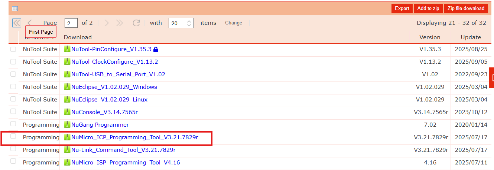

  <a href="en/01.development-environment.md">English</a> | <a href="01.development-environment.md">한국어</a>

# 개발환경

이 프로젝트는 WSL2(Windows Subsystem for Linux 2)에서 개발이 가능하도록 구성되어 있습니다.

## 권장 환경

- **운영체제**: Windows 10/11 + WSL2 
- **IDE**: Visual Studio Code
- **필수 도구**: make

## WSL2
- WSL2를 사용할 수 있도록 환경을 구성해 주십시오.

## IDE
- 자사에서는 Visual Studio Code를 사용하여 개발하고 있습니다.
(별도의 편집 프로그램을 사용하셔도 좋습니다.)

## 펌웨어 다운로드 도구
- 펌웨어 다운로드는 Nuvoton에서 제공하는 ICP Tool을 사용합니다.

- **ICP Tool**: Windows 환경에서 실행합니다.
- Nuvoton 공식 홈페이지에서 다운로드 받을 수 있습니다.

## Nuvoton M2354 보드
- Nuvoton M2354 보드 기준으로 시큐어펌웨어, SDK프로젝트가 작성되어 있습니다.
- 회로도 : docs/pdf/MCB1800v1-3-schematics.pdf
  

## Nulink Pro
- Nulink Pro는 nuvoton에서 제공하는 디버그 모듈입니다.
- ICP Tool을 통하여 펌웨어 다운로드, 칩초기화 등의 기능을 사용할수 있습니다.

## 테스트 환경 구성
- usb케이블을 이용하여 M2354 board와 pc를 아래와 같이 연결해 주십시오.

[← 이전: 메인 페이지](main.md) | [다음: 환경설정 →](02.setup.md)
