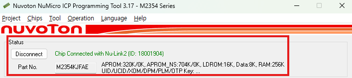
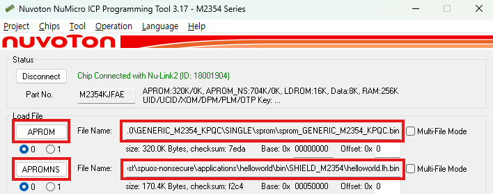
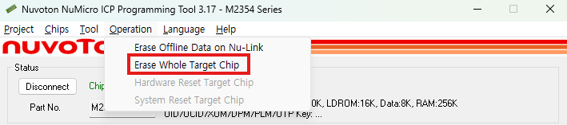

  <a href="en/04.firmware-download.md">English</a> | <a href="04.firmware-download.md">한국어</a>

# 펌웨어 다운로드

Nuvoton ICP Tool을 사용하여 M2354 칩에 펌웨어를 다운로드합니다.

## 준비사항

1. **Nuvoton ICP Tool 설치**
   - Nuvoton 웹사이트에서 ICP Programming Tool을 다운로드해 주십시오.
   - Windows 환경에서 실행이 가능합니다.
2. **usb 연결**
   - M2354보드는 usb케이블로 pc와 연결할 수 있습니다.
   - M2354보드의 디버그 연결핀을 usb케이블을 이용해 pc와 연결해 주십시오.
3. **펌웨어 파일 준비**
   - Secure 펌웨어: `secure/V2.0.0/GENERIC_M2354_KPQC/SINGLE/sprom/sprom_GENERIC_M2354_KPQC.bin`를 사용합니다.
   - Non-Secure 펌웨어: 빌드가 완료되면 `applications/helloworld/bin/SHIELD_M2354/helloworld.lh.bin`이 생성이 됩니다.

## 다운로드

### 1. ICP Tool 실행

1. Nuvoton ICP Programming Tool을 실행해 주십시오.

### 2. 디바이스 연결

1. **Connect** 버튼을 클릭하여 디바이스 연결을 확인해 주십시오.

- 정상적으로 연결되면 Chip Connected with Nu-Link-Pro 라는 문구가 표시됩니다.

### 3. Secure 펌웨어 설정

1. **APROM** 탭 선택
2. **File Path** 설정:
   - `secure/V2.0.0/GENERIC_M2354_KPQC/SINGLE/sprom/sprom_GENERIC_M2354_KPQC.bin`

### 4. Non-Secure 펌웨어 설정

1. **APROM_NS** 탭 선택
2. **File Path** 설정:
   - `applications/helloworld/bin/SHIELD_M2354/helloworld.lh.bin`

### 5. 다운로드

1. **Programming** 그룹박스의 APROM을 체크해 주십시오.
2. **Programming** 그룹박스의 APROM_NS를 체크해 주십시오.
3. **Start** 버튼을 클릭하여 펌웨어 다운로드를 시작해 주십시오.

4. 시큐어펌웨어가 다운로드 되어 있는 상태라면 APROM_NS만 다운로드가 가능합니다.

### 6. 초기화

1. **초기화** 메뉴의 Operation->Erase Whole Target Chip을 클릭해 주십시오.

### 7. 기타
- ICP Tool의 상세한 기능은 nuvoton 홈페이지에서 사용자 메뉴얼을 참고해주십시오.

[← 이전: 빌드](03.build.md) | [다음: 실행화면 →](05.runtime.md)
