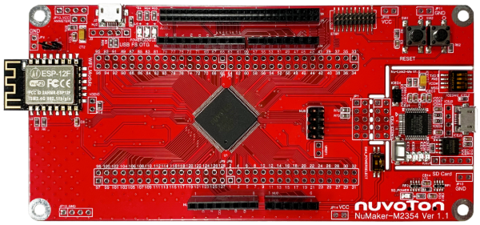
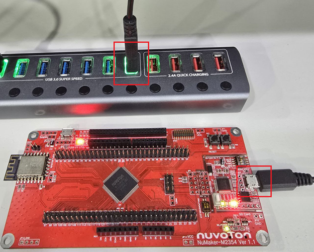

  <a href="01.development-environment.md">English</a> | <a href="../01.development-environment.md">한국어</a>

# Development Environment

This project is configured to be developed on WSL2 (Windows Subsystem for Linux 2).

## Recommended setup

- **OS**: Windows 10/11 + WSL2
- **IDE**: Visual Studio Code
- **Required tool**: `make`

## WSL2
- Set up your environment so that you can use WSL2.

## IDE
- We develop using Visual Studio Code.
  (You may use a different editor if you prefer.)
...

- Schematic: `docs/pdf/MCB1800v1-3-schematics.pdf`

## NuLink Pro
- NuLink Pro is a debug module provided by Nuvoton.
- With the ICP Tool, you can download firmware and perform chip initialization/erase operations.

## Test setup
- Connect the M2354 board to your PC using a USB cable as shown below.

[← Previous: main](main.md) | [Next: Setup →](02.setup.md)
