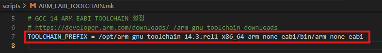
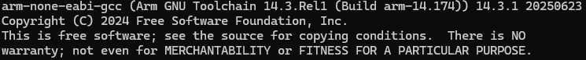

<p align="right">
  <a href="02.setup.md">English</a> | <a href="../02.setup.md">한국어</a>
</p>

# Setup

## Toolchain configuration

### 1. Download the ARM GCC toolchain

- From https://developer.arm.com/downloads/-/gnu-rm, download the **"14.3.rel1-x86_64-arm-none-eabi"** release.

- **Filename**: `arm-gnu-toolchain-14.3.rel1-x86_64-arm-none-eabi`
- **Platform**: Linux x86_64

### 2. Configure the toolchain path

- Set the toolchain path in `scripts/ARM_EABI_TOOLCHAIN.mk`.

```makefile
ARM_EABI_TOOLCHAIN = /opt/arm-gnu-toolchain-14.3.rel1-x86_64-arm-none-eabi
```



### 3. Verify the toolchain

- Verify that the installation is correct:

```bash
/opt/arm-gnu-toolchain-14.3.rel1-x86_64-arm-none-eabi/bin/arm-none-eabi-gcc --version
```

- Example output:



[← Previous: Development environment](01.development-environment.md) | [Next: Build →](03.build.md)
