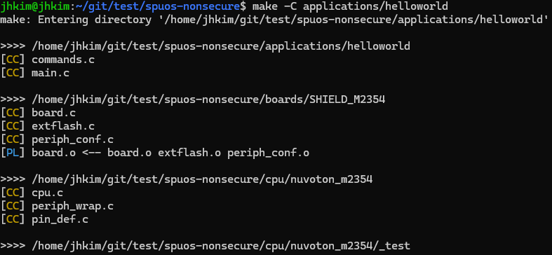
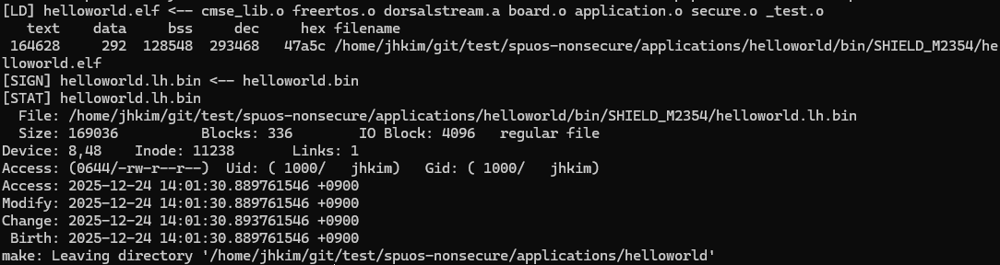

<p align="right">
  <a href="03.build.md">English</a> | <a href="../03.build.md">한국어</a>
</p>

# Build

## Build commands

### Build

- From the project directory, run:

```bash
make -C applications/helloworld
```


<br>


### Build outputs

- If the build succeeds, the following files are generated:

```
applications/helloworld/bin/SHIELD_M2354/
├── helloworld.elf          # ELF file
├── helloworld.bin          # Binary file
├── helloworld.lh.bin       # Binary for flashing/download
├── helloworld.hex          # HEX file
└── helloworld.map          # Memory map file
```

### Clean

- To remove build artifacts, run:

```bash
make -C applications/helloworld clean
```

## Build structure

The project uses a hierarchical Makefile structure:

```
applications/helloworld/Makefile    # Application Makefile
Makefile.base                       # Base build rules
Makefile.include                    # Common settings
...
```

- The build proceeds by referencing and building each module.

[← Previous: Setup](02.setup.md) | [Next: Firmware download →](04.firmware-download.md)
