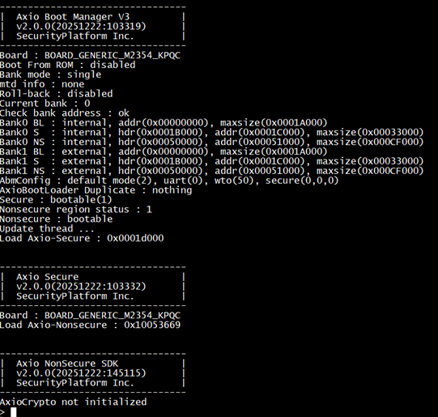

<p align="right">
  <a href="05.runtime.md">English</a> | <a href="../05.runtime.md">한국어</a>
</p>

# Runtime

After boot completes, the Shell interface runs over the console UART.

## Boot sequence

1. **Bootloader**: Performs firmware verification.
2. **Secure**: Verifies the device certificate and firmware.
3. **Non-Secure**: Initializes the board, FreeRTOS, Shell, etc.
4. **Shell start**: The UART shell interface becomes available.

## Shell screen

- After boot, the following banner and shell prompt are shown on the console UART.



## Console UART terminal settings

- **Baud Rate**: 115200
- **Data Bits**: 8
- **Parity**: None
- **Stop Bits**: 1
- **Flow Control**: None

## Shell Commands

- You can explore available features using shell commands.
```
> help
Command              Description
---------------------------------------

reset                reset the board
fheap                print FreeRTOS heap status
fps                  print FreeRTOS process status
finfo                print FreeRTOS version
pqc                  AxioCrypto PQC Example
```

[← Previous: Firmware download](04.firmware-download.md) | [Next: Examples →](06.examples.md)
