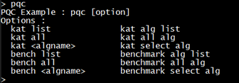
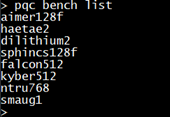
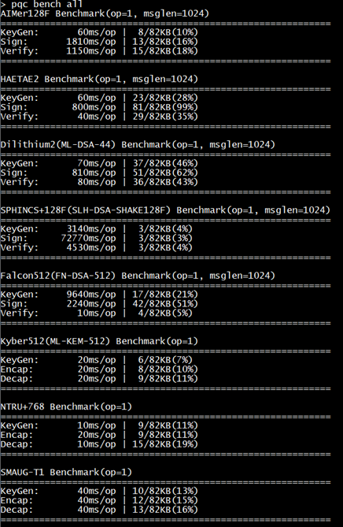
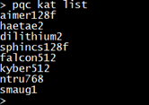
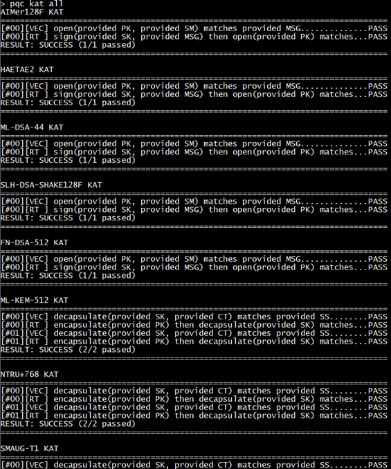

<p align="right">
  <a href="06.examples.md">English</a> | <a href="../06.examples.md">한국어</a>
</p>

# Examples

## PQC

- Examples for running benchmarks and KAT(Known Answer Test) for PQC algorithms.

### How to run

```bash
> pqc
```

PQC example usage



```bash
> pqc bench list
```

List the algorithms available for PQC benchmark tests



```bash
> pqc bench all
```

Run all PQC benchmark tests



```bash
> pqc kat list
```

List the algorithms available for PQC KAT tests



```bash
> pqc kat all
```

Run all PQC KAT tests




### Source Code

```
sys/axiocrypto_pqc_example/
├── axiocrypto_pqc_example.c        # Example main
├── axiocrypto_pqc_bench.c          # Benchmark
├── axiocrypto_pqc_kat.c            # KAT
├── axiocrypto_pqc_common.c         # Common functions
├── axiocrypto_pqc_aimer128f.c      # AIMer128F test
├── axiocrypto_pqc_dilithium2.c     # Dilithium2 test
├── axiocrypto_pqc_falcon512.c      # Falcon512 test
├── axiocrypto_pqc_haetae2.c        # HAETAE2 test
├── axiocrypto_pqc_kyber512.c       # Kyber512 test
├── axiocrypto_pqc_ntru768.c        # NTRU+768 test
├── axiocrypto_pqc_smaug1.c         # SMAUG-T1 test
└── axiocrypto_pqc_sphincs128f.c    # SPHINCS+128F test
```

[← Previous: Runtime](05.runtime.md) | [Next: Modules →](07.modules.md)
